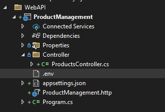

# ProductManagement

How to run locally ProductManagement

1. Get .env file and place in the WebAPI folder

    1.2 Make sure the env password matches yours

2. Open Package Manager Console (View->Other Windows->Package Manager Console)

3. Type the following: Update-Database

    3.1 IN CASE IT DOES NOT UPDATE, try the following: Add-Migration "MIGRATION_NAME", then do Update-Database

4. Build and run http

